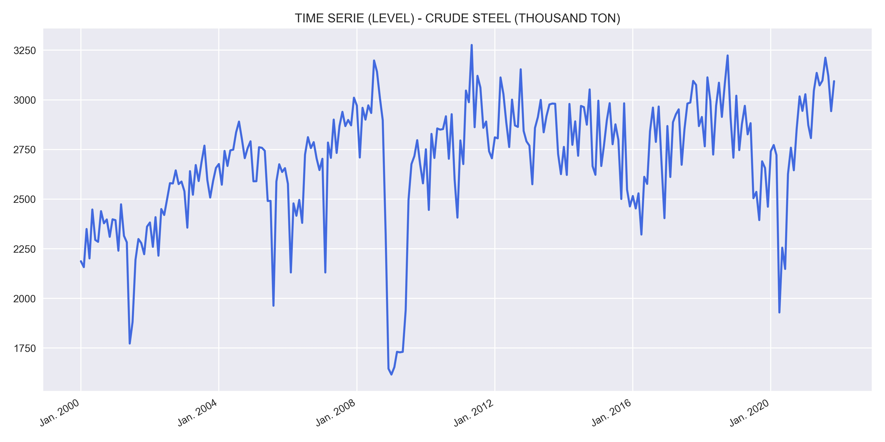
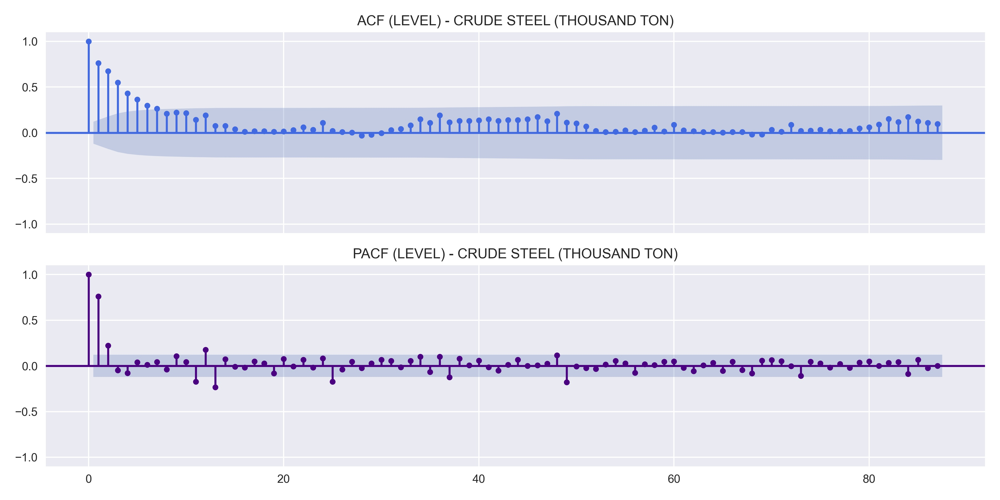
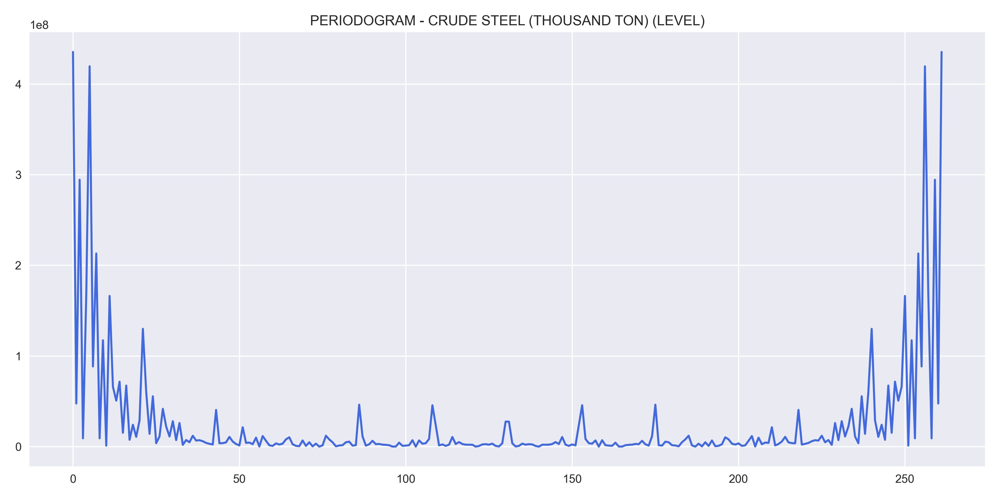
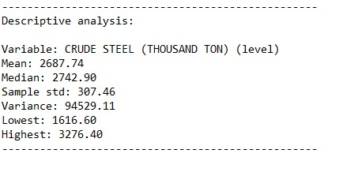
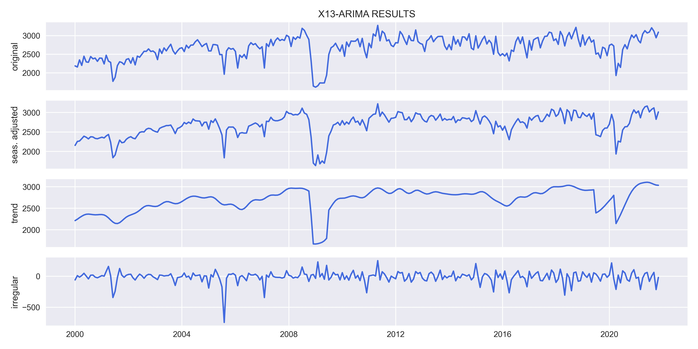
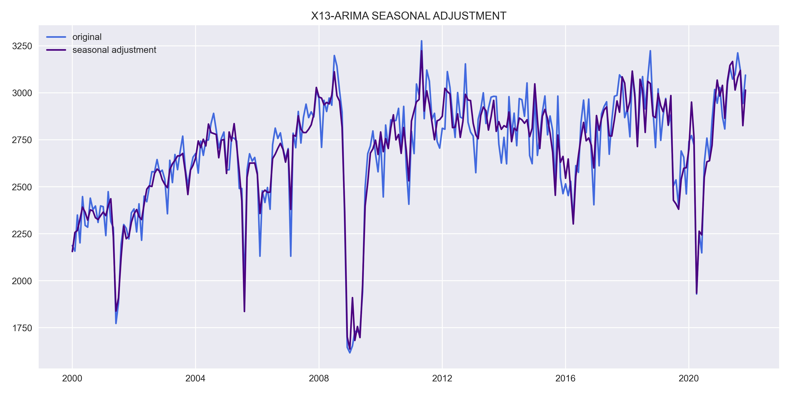
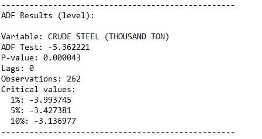
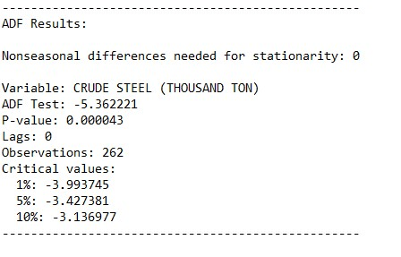
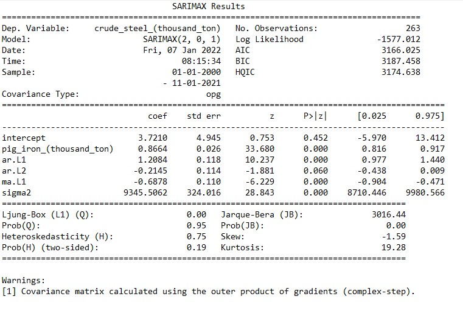
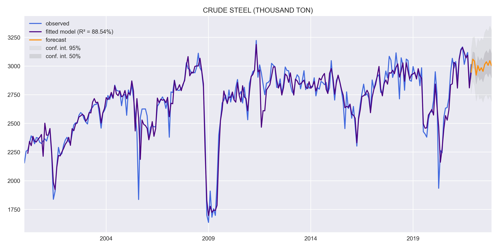

# **DESCRIPTION**

## Forecast of crude steel production explained by pig iron production.

## Pig iron
The vast majority of pig iron is produced and consumed within integrated steel mill complexes. In this context the term “pig iron” is something of a misnomer: within integrated steel mills, blast furnace iron is transferred directly to the steel plant in liquid form, better known as "hot metal" or "blast furnace iron."

The term “pig iron” dates back to the time when hot metal was cast into ingots before being charged to the steel plant. The moulds were laid out in sand beds such that they could be fed from a common runner. The group of moulds resembled a litter of sucking pigs, the ingots being called “pigs” and the runner the “sow.”

## Merchant pig iron
Merchant pig iron is cold pig iron, cast into ingots and sold to third parties as feedstock for the steel and ferrous casting industries.

Merchant pig iron is produced by

* Dedicated merchant plants - all of whose production is sold to external customers; 
* Integrated steel mills - with iron that is surplus to their internal requirements and cast into ingots and sold to the merchant market.

## Types of merchant pig iron
Merchant pig iron comprises three main types:

* Basic pig iron:
  Used mainly in electric arc steelmaking

* Foundry pig iron (also known as haematite pig iron): 
  Used in mainly in the manufacture of grey iron castings in cupola furnaces

* High purity pig iron (also known as nodular pig iron): 
  used in the manufacture of ductile [also known as nodular or spheroidal graphite – SG] iron castings.

There are also various sub-types, for example low manganese basic pig iron, semi-nodular pig iron etc.

## Composition and characteristics
Pig iron contains at least 92% Fe and has a very high carbon content, typically 3.5 - 4.5%.

## Crude steel
Mineral transformation comprises the conversion of ferrous and non-ferrous ores into metallurgical products by thermal, electrometallurgical or not (furnaces, converters, etc.), and other metallurgical processing techniques to obtain intermediate products for the processing of metallic ores, such as such as pig iron, liquid steel, calcined or not calcined alumina, copper and nickel metallurgical mattes, etc., the production of metals in primary or semi-finished forms (ingots, slabs, billets, billets, stilts, etc.), the production of laminated, re-rolled, drawn, redrawn (plates, coils, bars, profiles, rails, rebar, wire rod, etc.) and the production of pipes and tubes. Steel production is a strong indicator of a country's stage of economic development. The wide variety of steels available on the market is due to the fact that each of their applications requires changes in composition and shape. Crude steel is a type of denomination used to measure the production of a steel mill and it means the cast steel before being worked into final or special products. Crude steel can also be in a liquid state. It is the total amount of crude steel produced by the different steel mills in the country.

Data source: Instituto Brasileiro de Siderurgia (data collected from the IPEADATA database).

# **RESULTS**
Results obtained through the model estimation process.

## Variable analysis at level:
    
    
    
    

## SEASONAL ADJUSTMENT:
    
    

## Study of data stationarity:
    
    

## Model results:
    

## Residual analysis:
    
    
    

# FORECAST:
    